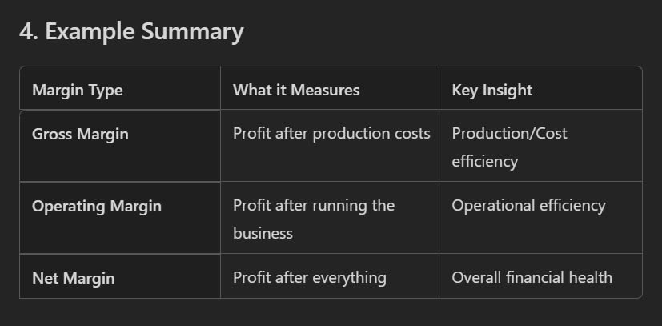

# KPI Visuals Report

## Overall KPIs

- Total Sales: 118726350.26

- Total COGS: 101832648.00

- Total Profit: 16893702.26

- Gross Margin %: 14.23%

## Country Performance

## Product Performance

## Segment & Discount

IMAGE

Total Profit = SUM('raw_financial_data_folder'[Profit])

Total Sales = SUM('raw_financial_data_folder'[Sales])